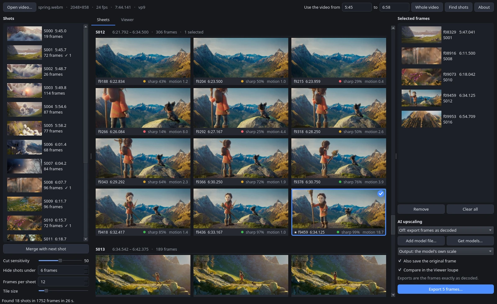
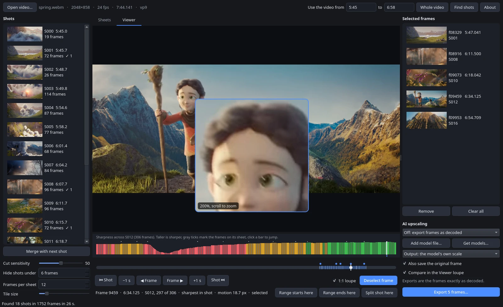
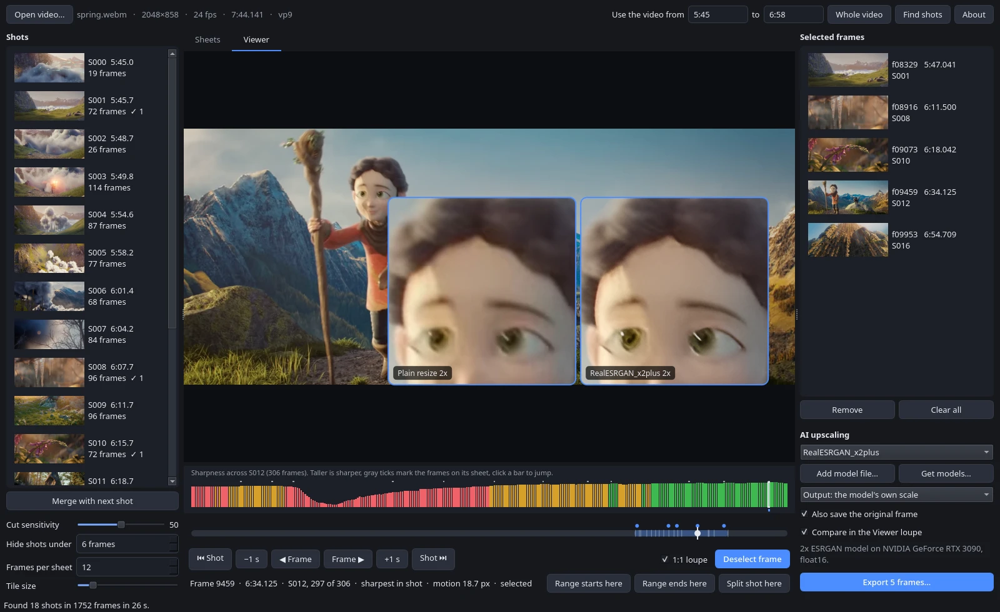

# Wallpaper Frame Picker

Wallpaper Frame Picker finds the sharpest frame in every shot of a video, lets you pick the frames with the pose you want, and exports them as full-resolution PNGs. It is made for pulling wallpapers and stills out of trailers, music videos and animation, where motion blur makes most frames unusable. An optional AI upscaling step runs the exported frames through Real-ESRGAN or most other models on [OpenModelDB](https://openmodeldb.info).

It has a desktop app and a command-line tool that share the same analyses, selections and models.

## Features

- Splits a video, or just the part you choose, into shots.
- Scores every frame for sharpness and motion, and shows each shot as a contact sheet of its sharpest frames.
- Click frames on the sheets to select them, or scrub the video and step frame by frame to pick any frame by hand.
- A 1:1 loupe shows real pixels, so you can check for motion blur before exporting.
- Exports exactly the frame you picked, at full resolution, with the color matrix and range the video declares.
- Optional AI upscaling on the GPU, with a side-by-side loupe that compares the model against plain resizing.
- Remembers each video's analysis and selections, even after you rename or move the file.

## Screenshots

Every shot of the chosen part of the video gets a sheet of its sharpest frames. A star marks the sharpest frame, and a check mark shows the frames you picked.



The Viewer steps through any frame. The 1:1 loupe shows real pixels, and the bars above the timeline show how sharp each frame of the shot is.



With an upscaling model chosen, the loupe compares plain resizing with the model's output.



The screenshots show frames from [*Spring*](https://commons.wikimedia.org/wiki/File:Spring_-_Blender_Open_Movie.webm) (2019) by Andy Goralczyk and the Blender Foundation, licensed under [CC BY 4.0](https://creativecommons.org/licenses/by/4.0/). The frames appear inside the app's interface, and the upscaled panel is the output of RealESRGAN_x2plus.

## Run it

Each release has a standalone app for Linux, Windows and macOS. It needs no Python, no package manager and no FFmpeg. Run one command, or download the file from the [releases page](https://github.com/onlykshitij/wallpaper-frame-picker/releases/latest) and open it.

Linux (x86_64), in a terminal:

```bash
curl -fLo WallpaperFramePicker https://github.com/onlykshitij/wallpaper-frame-picker/releases/latest/download/WallpaperFramePicker-linux-x86_64 && chmod +x WallpaperFramePicker && ./WallpaperFramePicker
```

Windows (x86_64), in PowerShell:

```powershell
irm https://github.com/onlykshitij/wallpaper-frame-picker/releases/latest/download/WallpaperFramePicker-windows-x86_64.exe -OutFile WallpaperFramePicker.exe; .\WallpaperFramePicker.exe
```

macOS (Apple Silicon), in Terminal:

```bash
curl -fLo WallpaperFramePicker.zip https://github.com/onlykshitij/wallpaper-frame-picker/releases/latest/download/WallpaperFramePicker-macos-arm64.zip && ditto -x -k WallpaperFramePicker.zip . && open WallpaperFramePicker.app
```

After that, start it again with `./WallpaperFramePicker`, `WallpaperFramePicker.exe` or `open WallpaperFramePicker.app`. The apps are about 200 MB because they carry Python, Qt, FFmpeg and OpenCV inside.

The apps are not code-signed. Downloaded with the commands above they open directly. Downloaded through a browser, Windows shows a SmartScreen warning (choose More info, then Run anyway) and macOS refuses the first start (right-click the app, choose Open, then Open again).

On Linux the same file also runs the command line, as `./WallpaperFramePicker cli ...`. On Windows the command line is a separate download, `WallpaperFramePicker-cli-windows-x86_64.exe`.

### With Python instead

If you have [uv](https://docs.astral.sh/uv/), this runs the latest code straight from GitHub:

```bash
uvx --from git+https://github.com/onlykshitij/wallpaper-frame-picker wallpaper-frame-picker
```

Or install it with pip into Python 3.10 or newer, which gives you the `wallpaper-frame-picker` and `wallpaper-frame-picker-cli` commands:

```bash
pip install git+https://github.com/onlykshitij/wallpaper-frame-picker
```

### AI upscaling

AI upscaling runs on PyTorch, a download of about 3 GB, so nothing includes it up front. The first time you pick a model, the app asks before downloading PyTorch into a separate environment. If uv is not installed, it also downloads its own copy of uv (about 20 MB) to do that. Everything after that first time works offline.

With the Python install you can add PyTorch yourself instead, with `pip install 'wallpaper-frame-picker[upscale] @ git+https://github.com/onlykshitij/wallpaper-frame-picker'` or `uv run --extra upscale wallpaper-frame-picker` in a clone. The upscaler then runs on the same Python as the app.

On Linux, PyTorch from PyPI includes CUDA support. On Windows, PyPI only has the CPU build; for an NVIDIA GPU, install the CUDA build into a Python install by following [pytorch.org](https://pytorch.org/get-started/locally/) and use the `upscale` extra. Apple GPUs are used through MPS, which has not been tested.

## Using the app

1. Open a video with Open video (Ctrl+O), or drop the file on the window.
2. Set the part of the video to use in the boxes next to "Use the video from". Times can be written as `83.5`, `1:23.5` or `0:01:23.5`. In the Viewer, "Range starts here" and "Range ends here" fill them from the frame on screen, and Whole video resets them.
3. Press Find shots. The app scores every frame in the range and splits it into shots. On a 32-thread desktop this ran at about 40 frames per second on a 4K test clip. The result is saved, so reopening the video, or entering the same range again, loads it at once.
4. The Sheets tab shows a sheet for every shot. Each sheet holds 12 frames spread across the shot, and each one is the sharpest frame in its part of the shot. Click a frame to select it, click again to deselect, and double-click to open it in the Viewer. A star marks the shot's sharpest frame.
5. The Viewer tab shows any frame of the video, inside the analyzed range or not. Drag the timeline to scrub, then step frame by frame to the exact pose. Press Space or Select frame to add it. Scroll over the picture to zoom the loupe to 200% or 400%.
6. Selected frames collect in the right-hand panel. Double-click one to view it, press Delete to remove it, and press Export to write them all as PNGs to a folder you choose.

### Reading the scores

Each sheet frame has a label like `f431  0:17.958 · sharp 92%  motion 3.1`:

- `f431` is the frame number, counted from 0, and `0:17.958` its time.
- `sharp 92%` means the frame is sharper than 92% of the frames in its shot. The dot is green at 75% and above, amber from 40%, red below.
- `motion 3.1` means 90% of the frame moves less than 3.1 full-resolution pixels per frame. A camera pan raises it across the whole frame even when the subject stays sharp, so trust `sharp` first.

In the Viewer, the bar strip above the timeline shows every frame of the current shot. Taller bars are sharper, gray ticks mark the frames on the shot's sheet, and blue marks show selected frames. Click a bar to jump to that frame. Animation often holds a pose for 2 or more frames, so if the best pose has a low score, check the frames next to it.

### Fixing shots

- Cut sensitivity changes how readily the app starts a new shot. Higher finds more cuts.
- Hide shots under leaves very short shots, such as flash frames, out of the list and the sheets. The default is 6 frames.
- Merge with next shot joins a shot to the one after it, for shots that strobe lighting or a flash split into pieces.
- Split shot here, in the Viewer, starts a new shot at the frame on screen.
- Frames per sheet and Tile size change the sheets.

### Keys

| Key | Action |
| --- | --- |
| Left, Right | Previous or next frame |
| Shift+Left, Shift+Right | One second back or forward |
| Page Up, Page Down | Sharpest frame of the previous or next shot |
| Home, End | First or last frame |
| Space or S | Select or deselect the frame on screen |
| Ctrl+1, Ctrl+2 | Sheets or Viewer |
| Ctrl+O | Open a video |
| Ctrl+E | Export selected frames |
| Delete | Remove the chosen frames from the selected list |

### Upscaling exports

1. Press Get models… to download one of the official Real-ESRGAN models, or Add model file… to use one you downloaded yourself. The [spandrel](https://github.com/chaiNNer-org/spandrel) library reads ESRGAN, Compact, SwinIR, HAT, DAT and many other architectures, so most OpenModelDB models work.
2. Choose the model in the list. The line under the options shows its scale and the device it runs on.
3. Choose the output size. "The model's own scale" gives 4x for a 4x model. "2x the video" resizes the model's output to twice the frame size. "Same size as the video" shrinks the output back to the frame size, which keeps the model's clean-up of compression artifacts without making the file bigger.
4. Leave "Also save the original frame" on to get both files.

With "Compare in the Viewer loupe" on, the loupe shows two panels when you hold the mouse still over the picture. The left one is the area enlarged by plain resizing, the right one is the model's output, both at the output size you chose.

On an RTX 3090, a compact model upscales a 3840x1636 frame 4x in about 1 second and a 6-block ESRGAN model in about 5 seconds. Bigger models take longer. The upscaler works in tiles, so large frames fit in limited VRAM.

Upscaling cannot bring back detail a video never had. It invents texture, and on animation it tends to smooth away film grain. If a frame already has more pixels than your screen, "Same size as the video" is usually the most useful setting.

Use model files from sources you trust. spandrel reads `.pth` files with a restricted unpickler, and `.safetensors` files cannot carry code at all.

### Exported files

Files are named `<video>_S014_f00431.png` (shot and frame number), or `<video>_f00431.png` for frames outside the analyzed range. Upscaled copies add the model and scale, as in `<video>_S014_f00431_RealESRGAN_x4plus_anime_6B_4x.png`.

## Command line

`wallpaper-frame-picker-cli` runs the same steps without a window. With uv, put `uv run` in front of each command. Without `--from` and `--to`, commands use the whole-video analysis if there is one, and analyze the whole video otherwise.

```bash
wallpaper-frame-picker-cli analyze video.mp4 --from 1:20 --to 2:05
```

```bash
wallpaper-frame-picker-cli shots video.mp4
```

```bash
wallpaper-frame-picker-cli sheets video.mp4 sheets/
```

```bash
wallpaper-frame-picker-cli export video.mp4 frames/ --picks sheets/picks.txt
```

- `analyze` scores the frames and splits the range into shots.
- `shots` lists the shots with their frame numbers and sharpest frame.
- `sheets` writes overview sheets with one frame per shot, a sheet of candidates for each shot, and `picks.txt` with one line per shot set to its sharpest frame. Each line is a name and a frame number, and text after `#` is ignored. Change the numbers to the poses you want; running `sheets` again keeps your edits.
- `export` writes PNGs for `--frames 431 862`, `--picks FILE`, or `--selected` (the frames selected in the app). Add `--upscale MODEL` for upscaled copies, `--scale 2` to set their size, and `--no-original` to skip the plain frames.
- `upscale --model MODEL IMAGE...` upscales image files you already have.
- `models` lists installed models, and `models --download realesr-animevideov3` fetches one of the official Real-ESRGAN models.

## Where files go

| What | Default location | Override |
| --- | --- | --- |
| Analyses, thumbnails, shot edits, selections | the user cache folder, `~/.cache/wallpaper-frame-picker` on Linux | `FRAME_PICKER_CACHE` |
| Upscaling models | the user data folder, `~/.local/share/wallpaper-frame-picker/models` on Linux | `FRAME_PICKER_MODELS` |
| The app's own copy of uv, if it needed one | the user data folder, in `bin/` | `FRAME_PICKER_DATA` |
| App settings | Qt's settings file for `wallpaper-frame-picker` | |

An analysis of a 4-minute 4K video takes about 150 MB, mostly thumbnails. Deleting the cache folder only means the next analysis starts from scratch.

## How it works

Each frame is split into a grid of tiles, 16 across. A tile's sharpness is the mean squared Laplacian of its brightness, measured at half and quarter resolution, because film grain dominates at full resolution. A frame's score is the mean of its 8 sharpest tiles. When the background is out of focus, those tiles sit on the subject, so motion blur on the subject lowers the score. Scores only compare frames within one shot.

Motion comes from DIS optical flow at 960 pixels wide, scaled up to full-resolution pixels.

A new shot starts where the average change in hue, saturation and brightness between neighboring frames jumps well above the change around it. This is the rule PySceneDetect's adaptive detector uses. Cut sensitivity scales its thresholds.

Frames are identified by their presentation timestamps, so the frame you see in the Viewer is the frame that gets exported, also for variable frame rate video. Colors are converted from YUV with the matrix and range the video declares, and BT.709 limited range test colors come back exact.

## Development

```bash
git clone https://github.com/onlykshitij/wallpaper-frame-picker.git
```

```bash
cd wallpaper-frame-picker
```

```bash
uv run wallpaper-frame-picker
```

```bash
uv run pytest
```

```bash
uv run --extra upscale pytest
```

The tests build a 264-frame synthetic video with PyAV. Every frame carries its frame number as a barcode, which lets the tests check that seeking and exporting return the exact frame. `uv run pytest` skips the upscaling tests; with the `upscale` extra they run with a random-weight model, which checks the plumbing but not picture quality. The GUI tests run offscreen.

To build the standalone app for the system you are on, and test it:

```bash
uv run --with pyinstaller python packaging/build.py
```

```bash
uv run python packaging/smoke_test.py dist/WallpaperFramePicker-linux-x86_64
```

PyInstaller only builds for the system it runs on, so the Windows and macOS apps come from GitHub Actions. Pushing a tag such as `v0.1.0` runs `.github/workflows/release.yml`, which builds and tests all three apps and publishes them as a GitHub release. Running that workflow by hand from the Actions tab gives you the builds as downloadable artifacts without making a release. The same workflow can publish to PyPI, after which `uvx wallpaper-frame-picker` works; it is off until you set up a [trusted publisher](https://docs.pypi.org/trusted-publishers/) on PyPI and set the repository variable `PUBLISH_TO_PYPI` to `true`.

The code lives in `src/wallpaper_frame_picker/`:

| File | Contents |
| --- | --- |
| `video.py` | Decoding, exact seeking, YUV to RGB conversion |
| `analysis.py` | Per-frame scores, shot detection, candidate frames, the cache |
| `export.py` | Writing PNGs, shared by the app and the CLI |
| `upscaler.py` | Client for the upscaler process, model list, model and uv downloads |
| `upscale_server.py` | The upscaler process (PyTorch and spandrel) |
| `app.py` | The Qt app |
| `cli.py` | `wallpaper-frame-picker-cli` |

`packaging/` holds the PyInstaller build script, the entry points of the standalone apps, and the smoke test.

## Credits

Wallpaper Frame Picker builds on [PyAV](https://github.com/PyAV-Org/PyAV) and FFmpeg, [PySide6](https://doc.qt.io/qtforpython-6/) (Qt), [OpenCV](https://opencv.org), [spandrel](https://github.com/chaiNNer-org/spandrel) and [PyTorch](https://pytorch.org). The shot cut rule comes from [PySceneDetect](https://www.scenedetect.com). The suggested models are the official [Real-ESRGAN](https://github.com/xinntao/Real-ESRGAN) releases, under the BSD-3-Clause license.

## License

Wallpaper Frame Picker is free software under the [GNU Affero General Public License v3.0 or later](LICENSE). You may use it for anything, including commercial work, and you may study, change and share it. If you distribute it, or a program built from it, you must release that program's source code under the same license. The AGPL also covers running a modified version as a network service: its users must be able to get the source too.

The license covers the code. The images and videos you work on with it stay yours, and frames you export from a video remain covered by that video's copyright. Models you download keep their own licenses.

The screenshots in `docs/screenshots/` are not covered by the AGPL. They contain frames from *Spring* by Andy Goralczyk and the Blender Foundation and are shared under [CC BY 4.0](https://creativecommons.org/licenses/by/4.0/).

The standalone apps bundle third-party libraries under their own licenses, including Qt and PySide6 (LGPL-3.0), FFmpeg through PyAV (LGPL and GPL), OpenCV (Apache-2.0) and NumPy (BSD-3-Clause). Their license files are included inside each app.
